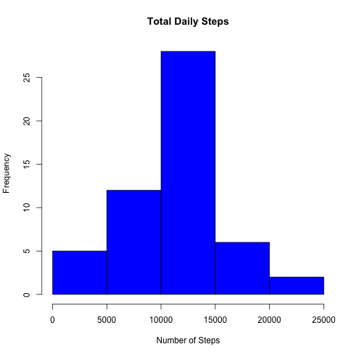
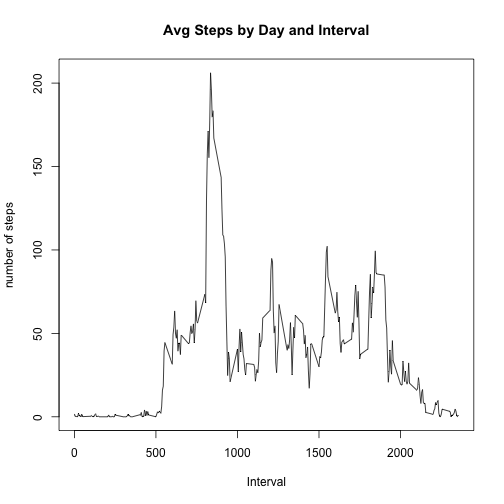
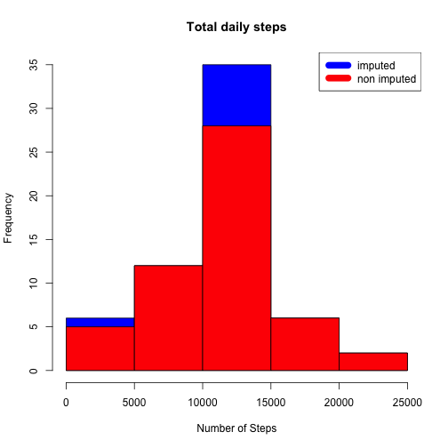
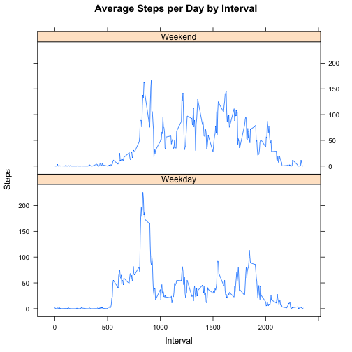

#This R Markdown document is for the reproducible research project 1
## The purpose of this project is to 
1. Load and pre process activity data 
2. Impute missing values 
3. Answer a series of questions about the activity

Read the activity data into a data frame - activity.csv must be in the current working directory


```r
data <- read.csv("activity.csv")
```

# Calculate Total number of steps per day - create histogram with results


```r
daily_steps <- aggregate(steps ~ date, data, sum)
hist(daily_steps$steps, main = paste("Total Daily Steps"), col = "blue", xlab = "Number of Steps")
```

 

# Calculate Mean and Median


```r
stepmean <- mean(daily_steps$steps)
stepmedian <- median(daily_steps$steps)
```
# Mean and Median Steps Report is below
The mean number of steps is 1.0766189 &times; 10<sup>4</sup>.

The median number of steps is 10765.

# Average Daily Activity Pattern
## this is a time series plot to show avg steps taken by 5 min intervals (x-axis), averaged accross all days (y-axis)

```r
intervalsteps <- aggregate(steps ~ interval, data, mean)
plot(intervalsteps$interval,intervalsteps$steps, type = "l",xlab = "Interval", ylab= "number of steps", main = "Avg Steps by Day and Interval")
```

 

# Find the maximum steps for an interval


```r
maxInter <- intervalsteps[which.max(intervalsteps$steps),1]
```


The maximum steps  for a 5 mins inteval accross all days is 835.

# Missing Values 
missing values are imputed using the average for each interval to replace 
any missing value 


```r
missingVal <- sum(!complete.cases(data))
missingValFix <- transform(data, steps= ifelse(is.na(data$steps),
                 intervalsteps$steps[match(data$interval,intervalsteps$interval)],data$steps))
```
set oct 01 2012 values to zero because this is the first day 

```r
missingValFix[as.character(missingValFix$date) == "2012-10-01", 1] <- 0
```
create historgrams

```r
steps_by_day_1 <- aggregate(steps ~ date, missingValFix, sum)
hist(steps_by_day_1$steps, main = paste("Total daily steps"), col="blue", 
     xlab="Number of Steps")
hist(daily_steps$steps, main = paste("Total Daily Steps"), col = "red", 
     xlab = "# of Steps", add=T)
legend("topright",c("imputed","non imputed"), col = c("blue","red"),lwd=10)
```

 

#Calculate new mean and median with the imputed data 

```r
newmean <- mean(steps_by_day_1$steps)
newmedian <- median(steps_by_day_1$steps)
```
 

the median number of steps with imputed data is 1.0766189 &times; 10<sup>4</sup>.

#calculate step difference 

```r
tot_diff <- sum(steps_by_day_1$steps) - sum(daily_steps$steps)
meandiff <- sum(stepmean - newmean)
meddiff <- sum(stepmedian - newmedian)
```

* the mean number of steps with imputed data is 1.0589694 &times; 10<sup>4</sup>.
* the median number of steps with imputed data is 1.0766189 &times; 10<sup>4</sup>.
* the total difference in steps for the imputed data and non imputed data is 7.5363321 &times; 10<sup>4</sup>
* the difference in mean for the imputed and non imputed data is 176.4948964
* the difference in median for the imputed and non imputed data is -1.1886792


# weekend and weekday differences
## this plot shows the activity difference between weekdays and weekends - there is more activity on weekends


```r
daysofweek <- c("Monday","Tuesday", "Wednesday", "Thursday", "Friday")

missingValFix$dow = as.factor(ifelse(is.element(weekdays(as.Date(missingValFix$date)),daysofweek),
                                    "Weekday","Weekend"))
intervalsteps_1 <- aggregate(steps ~ interval + dow, missingValFix, mean)

library(lattice)

xyplot(intervalsteps_1$steps ~ intervalsteps_1$interval|
           intervalsteps_1$dow, main="Average Steps per Day by Interval", xlab = "Interval"
       ,ylab = "Steps", layout=c(1,2), type="l")
```

 
